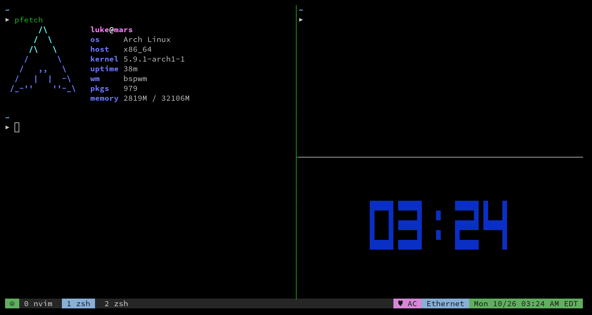

# Space Camp TMUX

A port of the Vim theme [Space Camp](https://github.com/jaredgorski/spacecamp) by Jared Gorski to TMUX.

**Features:**

* Shows Battery Status.
* Shows Network Status.
* Shows RAM/CPU Status.
* Shows Timezone and Date Information.

**NOTE:** The source code of this theme was forked from and based on [the Dracula TMUX theme](https://github.com/dracula/tmux).

## Install

### Using [TPM](https://github.com/tmux-plugins/tpm) (recommended)

If you use TPM you can easily install the theme by simply adding `set -g @plugin 'dracula/tmux'` to your TMUX configuration file.

After that, run `prefix + I` (default prefix is ctrl+b) in your TMUX window. This will fetch the plugin and reload the TMUX session.

### Manually

...

## Configuration

| Key                         | Description                                | Default |
|-----------------------------|--------------------------------------------|---------|
| `@spacecamp-show-battery`   | Whether to show battery status.            | `true`  |
| `@spacecamp-show-network`   | Whether to show network status.            | `true`  |
| `@spacecamp-show-flags`     | Whether to display flags on tabs.          | `false` |
| `@spacecamp-show-left-icon` | The contents of the left icon on the bar. Can accept `window`, `session`, `smiley`, or any other value. | `smiley` |
| `@spacecamp-show-timezone`  | Whether to show the timezone.              | `true`  |
| `@spacecamp-cpu-usage`      | Whether to show the system's CPU usage.    | `false` |
| `@spacecamp-ram-usage`      | Whether to show the system's RAM usage.    | `false` |
| `@spacecamp-day-month`      | Swaps date to day/month.                   | `false` |
| `@spacecamp-show-time`      | Whether to display the system time or not. | `true`  |
| `@spacecamp-refresh-rate`   | Adjusts the refresh rate of the bar        | `5`     |

## Contributors

The development of Space Camp TMUX is lead by [Luke Whrit](https://github.com/lukewhrit). Other contributors are listed [here on the contributors page](https://github.com/lukewhrit/spacecamp-tmux/graphs/contributors).

Dracula for TMUX was originally made to by:

* [Dane Williams](https://github.com/danerwilliams),
* [Ethan Edwards](https://github.com/ethancedwards8),
* and [others](https://github.com/dracula/tmux/graphs/contributors).

## License

The theme is available under the terms of the [MIT License](./LICENSE).
